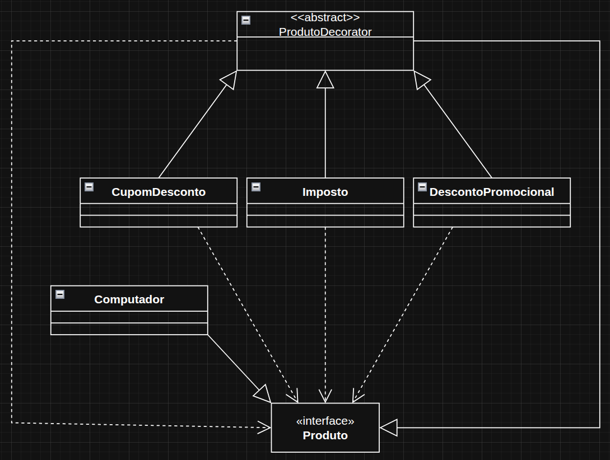

# Decorator

O Decorator é um padrão de projeto estrutural que permite adicionar novas funcionalidades a um objeto sem alterar sua estrutura original.

Em outras palavras: você “envolve” um objeto com outro que acrescenta um comportamento extra — como se colocasse camadas adicionais.

O exemplo usado foi de uma empresa que vende um determinado produto (no caso um computador, mas se aplica a toda e qualquer empresa que distribui um determinado produto) e oferece descontos, cupons de desconto e precisa repassar uma certa porcentagem de imposto que acaba indo para o preço final do produto. Nesse exemplo é possível ainda adicionar ou retirar mais algum percentual ao valor do produto caso seja necessário.

